Author: Rohit Gupta

# HDFS vs HBase vs Hive 

## Hadoop

It gives users the ability to manage distributed computing and storage easily. It does this by dividing documents across several stores and blocks across a cluster of machines.

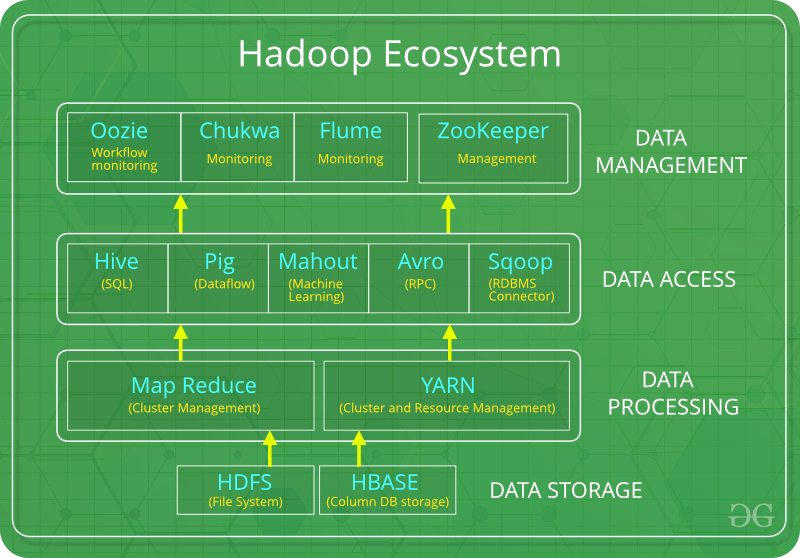

## HDFS 

- HDFS is a primary-secondary topology running on two daemons — DataNode and NameNode.
- The name node stores the metadata where all the data is being stored in the DataNodes. Also, if your NameNode goes  
  down, and you don’t have any backup, then your whole Hadoop instance will be unreachable.
- The DataNodes, on the other hand, are where the data is actually stored. If any specific DataNode is down, this 
  should be OK because the NameNode will often manage multiple instances of the same blocks of data across data nodes (this is somewhat dependent on configuration).
- HDFS is a great choice to deal with high volumes of data needed right away. 

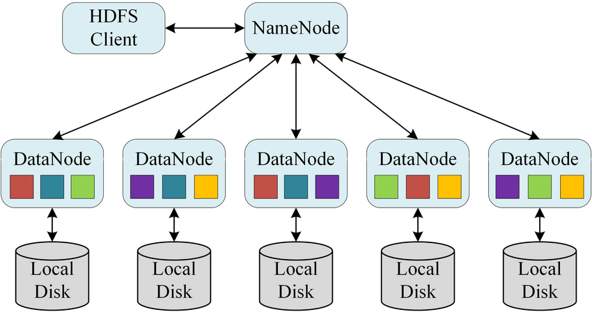

## HBase 

- HBase is an open-source, column-oriented database that’s built on top of the Hadoop file system. 

- It’s horizontally scalable. The data model of HBase is similar to that of Google’s big table design. It not only provides quick random access to great amounts of unstructured data but it also leverages equal fault tolerance as provided by HDFS. 

- HBase is part of the Hadoop ecosystem that provides read and write access in real-time for data in the Hadoop file system.  

- What’s even greater is the fact that HBase provides lower latency access to single rows from A million number of records. To work, HBase uses hash tables internally and then provides random access to indexed HDFS files. 

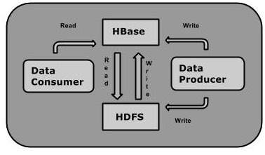

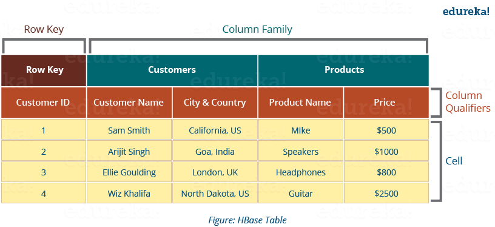

## Hive 

- Hive is a data warehouse software that allows users to quickly and easily write SQL-like queries to extract data from Hadoop. 

- The main purpose of this open-source framework is to process and store huge amounts of data. In the case of Hadoop, you can implement SQL queries using MapReduce Java API. In the case of Apache Hive you can easily bypass the Java and simply access data using the SQL like queries. 

-  It translates the input program written in HiveQL into one or more Java MapReduce and Spark jobs.

- It then organizes the data into HDFS tables and runs the jobs on a cluster to produce results. Hive is a simple way to apply structure to large amounts of unstructured data and then perform SQL based queries on them. Since it uses an interface that’s familiar with JDBC (Java Database Connectivity), it can easily integrate with traditional data center technologies.

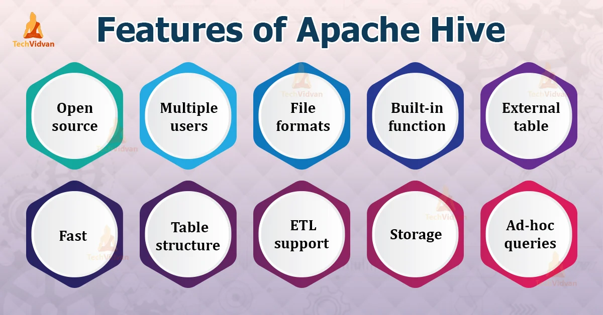

##  Difference between Hbase and Hive 

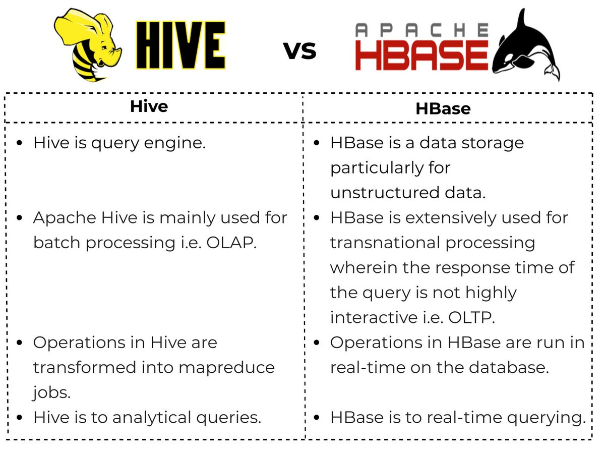 

## Difference between Hbase and HDFS 
source: Edureka

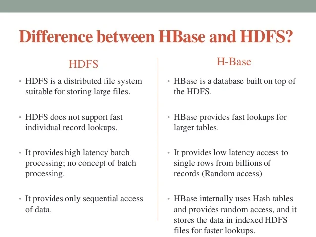 

source : projectpro
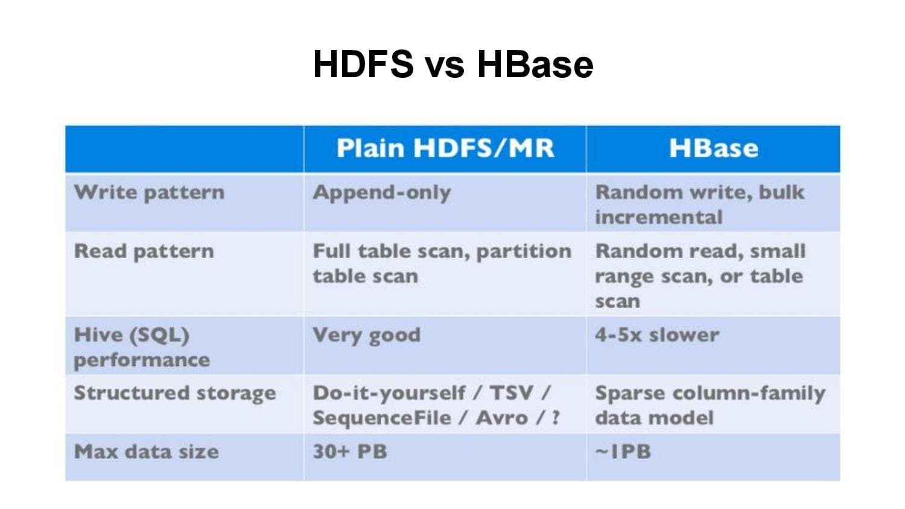

## Use Cases 

### Hadoop/HDFS 

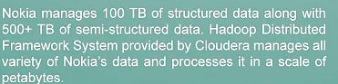

### HBase 

#### Type of usecases 

i. Data volume
It is must process petabytes of data in this distributed environment else it will be a misuse of technology framework. The reason behind this is for a small amount of data, it keeps all other nodes idle, it will be stored and processed in a single node only.

ii. Application Types
While we have a variable schema with slightly different rows and when you are going for a key dependent access to our stored data, we prefer to use HBase.

iii. Hardware Environment
If you have good hardware support, as HDFS works efficiently with a large number of nodes (minimum 5), and HBase runs on top of HDFS, then, HBase can be a right choice.

iv. No requirement of relational features
If we do not need features like transaction, triggers, complex query, complex joins etc. then go for HBase.

v. Quick Access to data

#### Use Case Example 

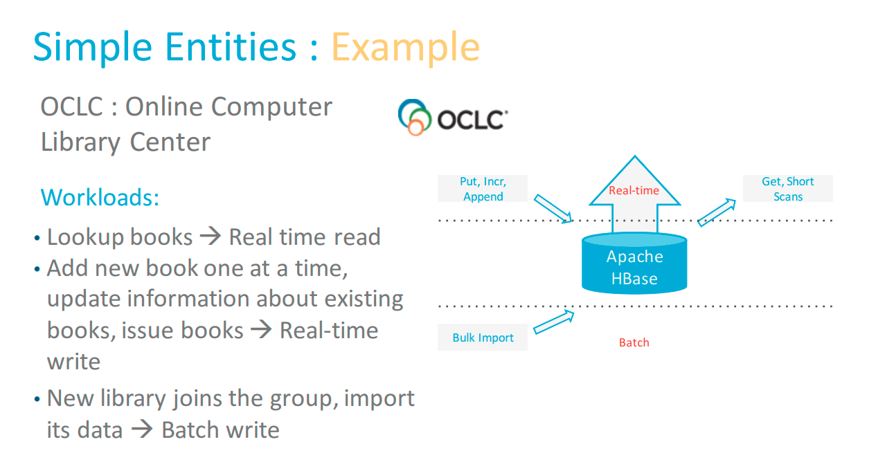

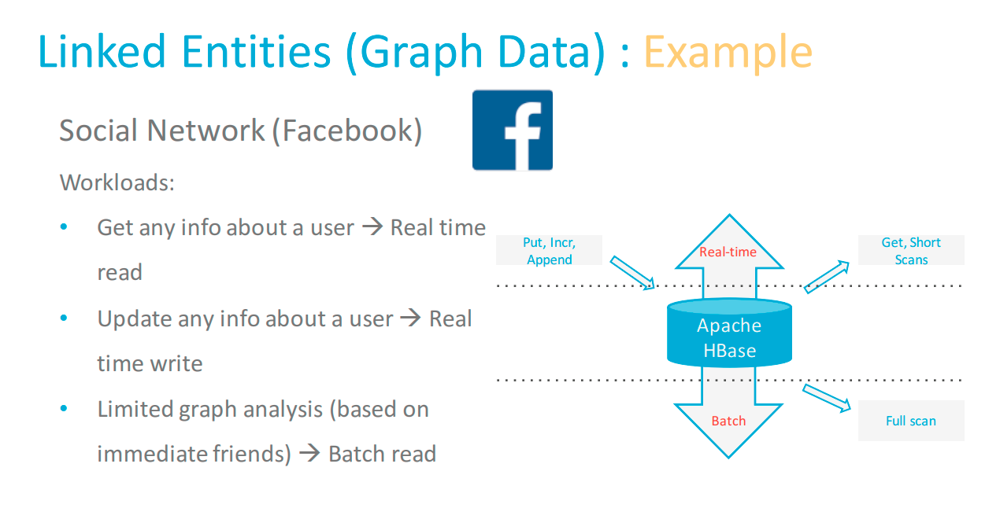

### Hive 

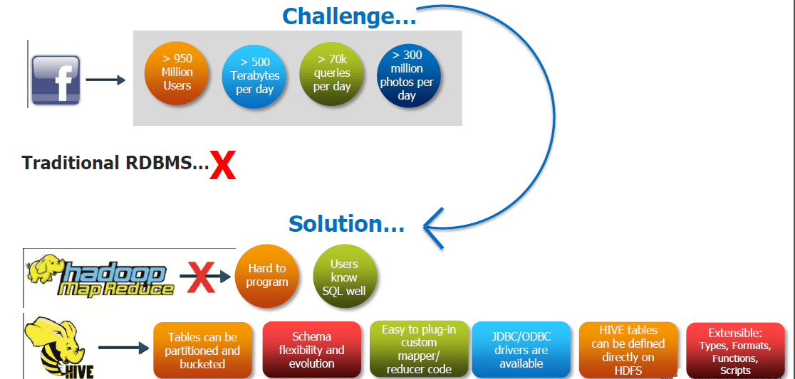

## Summary 
All these open-source tools and software are designed to help process and store big data and derive useful insights from it.  

Hadoop works as a file storage framework, which in turn uses HDFS as a primary-secondary topology to store files in the Hadoop environment.

HBase then sits on top of HDFS as a column-based distributed database system built like Google’s Big Table — which is great for randomly accessing Hadoop files. Hive, on the other hand, provides an SQL-like interface based on Hadoop to bypass JAVA coding.

